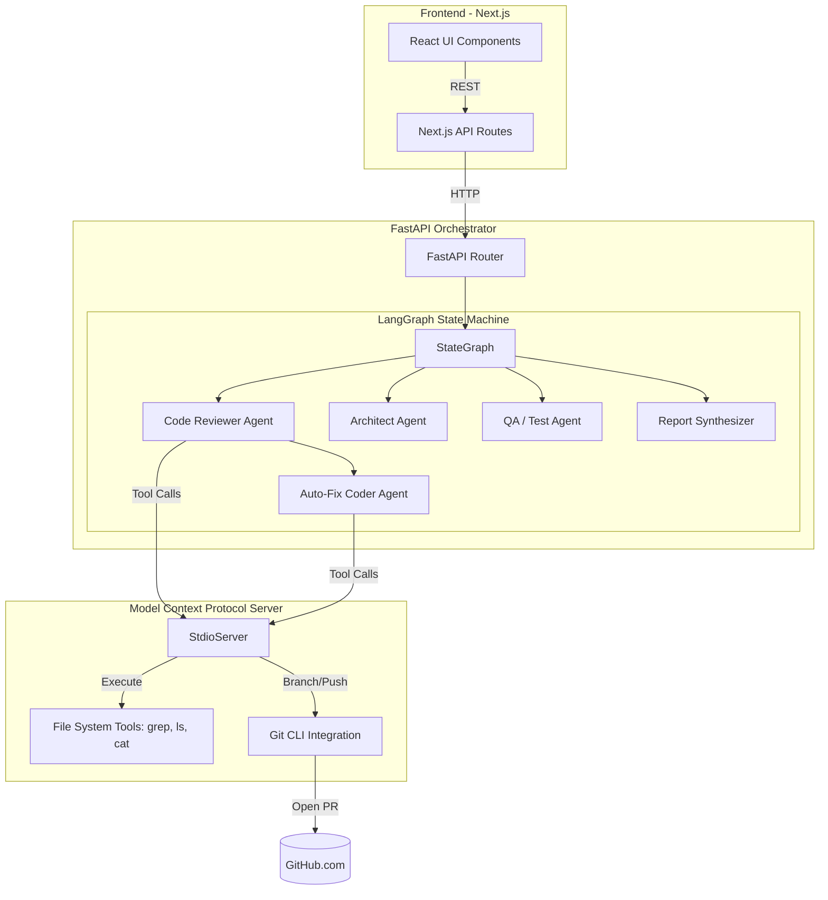
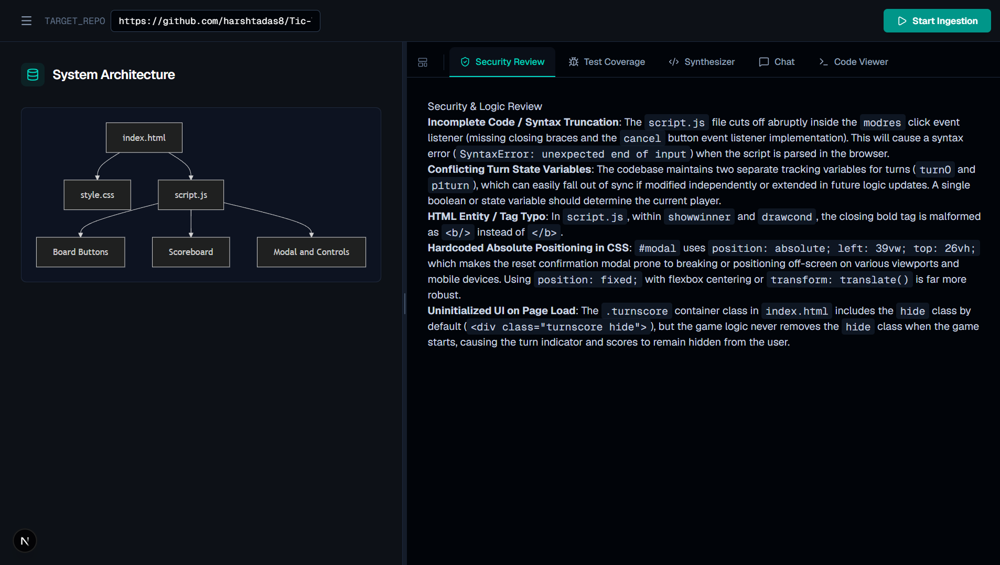
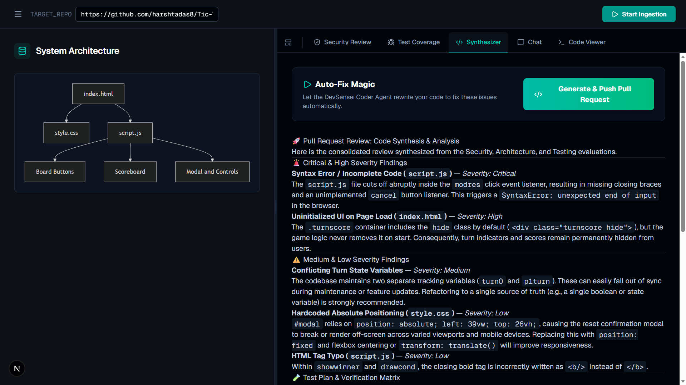
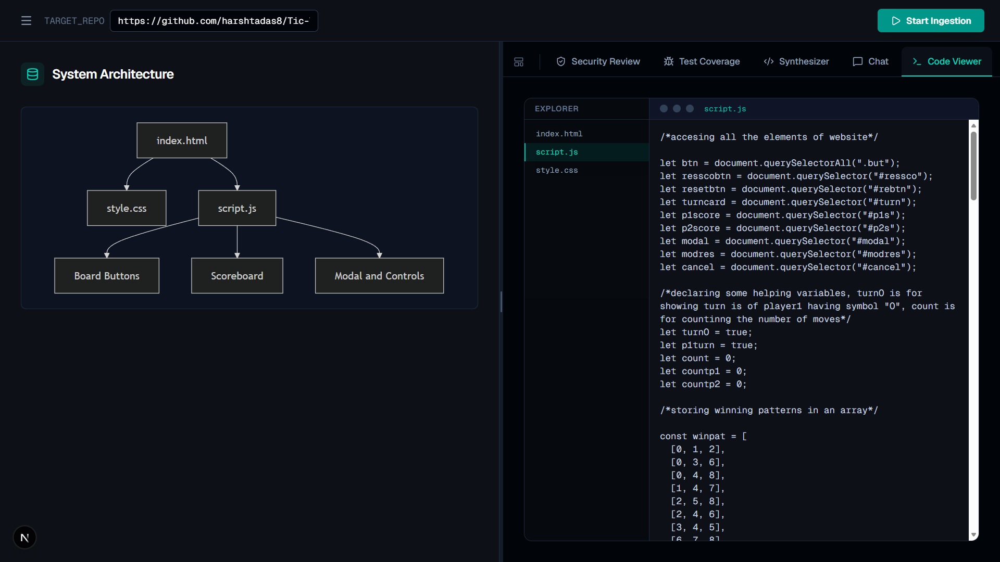
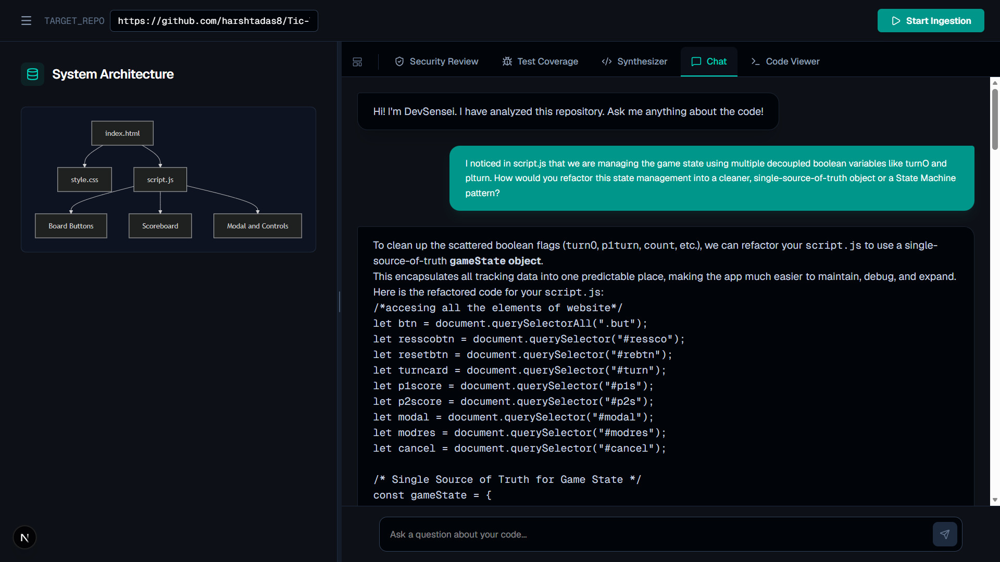
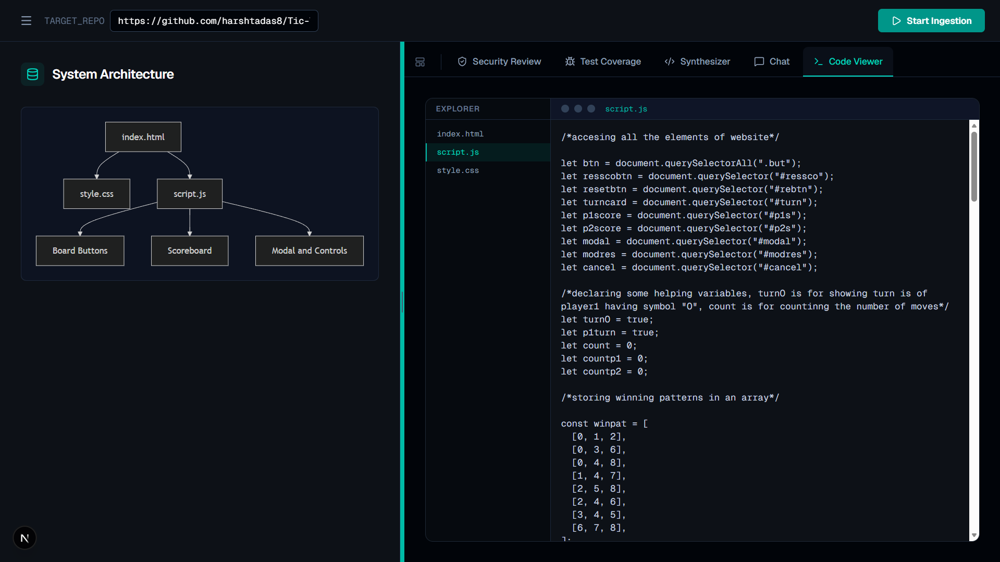
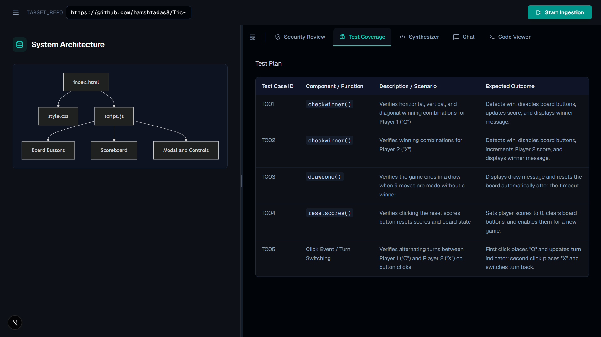

<div align="center">
  <h1>🗡️ DevSensei: Agentic Codebase Intelligence</h1>
  <p><em>An autonomous, multi-agent code reviewer and auto-fixer built on the Model Context Protocol (MCP).</em></p>
</div>

> **A production-grade, multi-agent AI pipeline featuring LangGraph orchestration, Model Context Protocol (MCP) file-system integration, Mermaid.js architecture generation, and automated GitHub Pull Request generation.**

**Live App (Frontend):** [https://dev-sensei-drab.vercel.app/](https://dev-sensei-drab.vercel.app/)  
**Backend API:** [https://devsensei-backend.onrender.com](https://devsensei-backend.onrender.com)  

[](https://github.com/harshtadas8/DevSensei/actions/workflows/eval.yml)

---

## 🚀 Engineering Highlights

- **Multi-Agent Orchestration (LangGraph)**: State-machine driven architecture abstracting `Reviewer`, `Architect`, `Tester`, `Coder`, and `Synthesizer` nodes. Prevents infinite reasoning loops using strict iteration caps.
- **Model Context Protocol (MCP)**: Utilizes a dedicated Python MCP server to grant the AI secure, real-time tool access to local file systems (`search_code`, `list_directory`, `read_file`) directly across Docker network bounds.
- **Automated GitHub Auto-Fixes**: The `CoderAgent` autonomously creates Git branches, commits code fixes, and pushes automated Pull Requests directly to GitHub via the GitHub REST API using injected PATs.
- **LLM-as-a-Judge CI/CD pipeline**: Automated GitHub Actions workflow (`eval.yml`) that runs a custom `scorer.py` script. It evaluates the AI's bug-finding recall rate on malicious patch fixtures to prevent regressions.
- **Visual System Architecture**: The `ArchitectAgent` automatically maps out codebase file dependencies and renders them instantly in the frontend using **Mermaid.js**.
- **Resilient Fallback Chains**: Seamless model fallback logic defaulting to `llama-3.3-70b-versatile` (Groq) for lightning-fast inference, degrading to `gemini-3.5-flash-lite` or local `DummyLLM`s for CI/CD environments.

---

## 🏗️ System Architecture



---

## ⚙️ Tech Stack

### Frontend
- **Framework**: Next.js (App Router), React 19
- **Styling**: Tailwind CSS v4, Framer Motion
- **Markdown & Diagrams**: `react-markdown`, `mermaid`

### Backend
- **Core**: Python 3.11+, FastAPI, Uvicorn
- **AI Orchestration**: LangGraph, LangChain (`langchain-google-genai`, `langchain-groq`)
- **Vector Store**: ChromaDB (For initial codebase ingestion)
- **Protocol**: `mcp` (Model Context Protocol)
- **Testing**: Pytest, LLM-as-a-Judge (`scorer.py`)

### Infrastructure
- **Containerization**: Docker & Docker Compose
- **Package Management**: `uv` (Ultra-fast Python package installer), `pnpm`

---

## 🧠 Core Features & Workflows

### Multi-Agent Code Review

When a repository is ingested, the LangGraph state machine triggers the `ReviewerAgent`. This agent searches the codebase for vulnerabilities (SQL injection, race conditions, syntax errors) and categorizes them by Severity. 

### Auto-Fix Magic (GitHub PR Generation)

If critical vulnerabilities are found, the state graph routes to the `CoderAgent`. When the user clicks **Generate & Push Pull Request**, the agent uses MCP to read the exact vulnerable files, generates standard Git patches, creates a new branch, and uses the `GITHUB_TOKEN` to push a live Pull Request to the user's repository instantly.

### Mermaid.js Architecture Mapping

The `ArchitectAgent` analyzes file imports and dependencies across the codebase to generate an immediate, visual Mermaid.js node graph, helping developers onboard into new codebases in seconds.

### Context-Aware AI Chat

Users can ask complex, architecture-level questions about their repository. The chat interface is strictly grounded in the ingested codebase context, allowing for deep refactoring suggestions, logic explanations, and codebase navigation without hallucination.

### Integrated Code Viewer

No need to switch between the dashboard and your IDE. DevSensei features an integrated Code Viewer that lets you inspect files, follow dependency paths, and verify AI findings in real-time.

### Automated Test Plan Generation

The `TesterAgent` identifies missing edge cases and outputs a structured Markdown table of recommended Test Cases (TCO1, TCO2), defining the component, description, and expected outcome for easy QA handoff.

---

## 🧪 Testing & CI/CD
DevSensei is gated by a rigorous **Enterprise Guardrails** GitHub Action.
- **Unit Testing**: Standard `pytest` suite testing agent routing logic.
- **LLM-as-a-Judge Evaluation**: The `eval/scorer.py` script feeds intentional vulnerable patches (e.g., N+1 query bugs, SQL injections) to the graph. The CI pipeline explicitly fails if the AI's vulnerability recall rate drops below 80% or if hallucination rates spike.

---

## 💻 Running Locally

### Prerequisites
- [Docker & Docker Compose](https://www.docker.com/) (Required for orchestrating the MCP Server and FastAPI)
- A GitHub Personal Access Token (for Auto-Fix PRs)
- Gemini / Groq API Keys

### Quickstart
1. Clone the repository:
   ```bash
   git clone https://github.com/harshtadas8/DevSensei.git
   cd DevSensei
   ```
2. Set up your environment variables:
   ```bash
   cp .env.example .env
   ```
   *(Open `.env` and paste your `GOOGLE_API_KEY`, `GROQ_API_KEY`, and `GITHUB_TOKEN`)*
3. Boot the backend and MCP server:
   ```bash
   docker-compose up -d --build
   ```
4. Start the frontend:
   ```bash
   cd apps/frontend
   pnpm install
   pnpm run dev
   ```
5. Open [http://localhost:3000](http://localhost:3000) and start analyzing!

---

## 👨‍💻 Author

**Harsh Tadas**  
Full-Stack AI Engineer focused on distributed systems, agentic AI pipelines, and robust backend architectures.  
**GitHub:** [https://github.com/harshtadas8](https://github.com/harshtadas8)

---

## Technical Write-Ups 📝

### 1. Integrating the Model Context Protocol (MCP)
The most significant technical hurdle was allowing the LLM to traverse a repository safely without hallucinating file names. Instead of dumping the entire repository into the context window (which breaks token limits), DevSensei implements the open-source **Model Context Protocol (MCP)**.
- The FastAPI backend spins up a background subprocess running an MCP Server (`apps/mcp-server`).
- The LangGraph agents are bound to MCP tools. When the AI needs to see a file, it outputs a tool call (`search_code` or `read_file`).
- The MCP server executes this safely inside a localized `/tmp/` volume clone and returns the text, completely eliminating hallucination.

### 2. LangGraph State Machine over standard Chains
Early prototypes of DevSensei used standard linear LangChain pipelines. This failed because complex bug fixes often require the AI to read a file, attempt a fix, realize a dependency is missing, and read another file. 
By migrating to **LangGraph**, DevSensei now utilizes a cyclical ReAct (Reason + Act) loop. The `CoderAgent` can loop up to 3 times, repeatedly calling MCP tools until it successfully verifies its own fix, vastly improving the final output quality.
